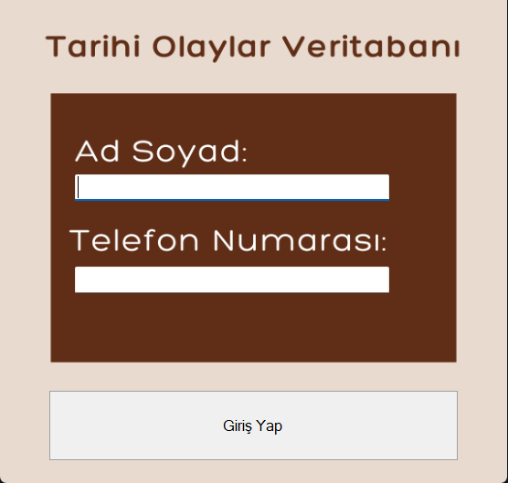
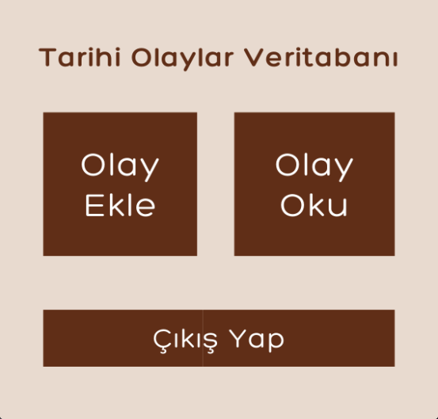
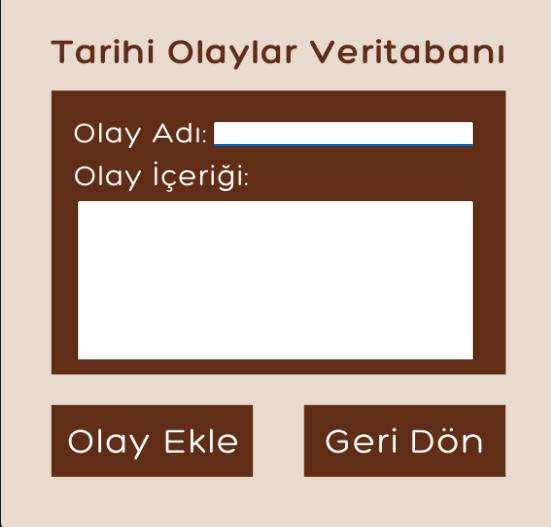
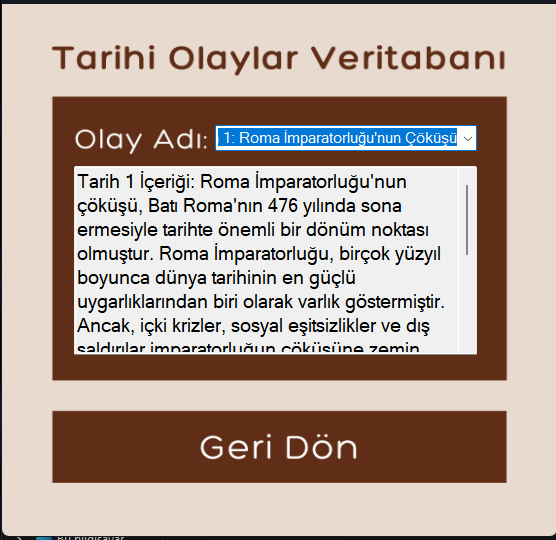

# 🏛️ Tarihi Olaylar Veritabanı

Bu proje, **C# Windows Forms** kullanılarak geliştirilmiş bir **Tarihi Olaylar Veritabanı** uygulamasıdır. Kullanıcılar, sistem üzerinden geçmişte yaşanmış önemli olayları görüntüleyebilir, olayları kategorilere göre filtreleyebilir ve detaylı bilgilerle inceleyebilir. Proje eğitim amaçlıdır.

## 🧩 Özellikler

- Tarihi olayları listeleme  
- Olay detaylarını görüntüleme  
- Kategoriye göre filtreleme  
- Basit ve kullanıcı dostu arayüz  

## 🛠️ Kullanılan Teknolojiler

- C# (Windows Forms)  
- .NET Framework  
- Visual Studio  
- (Opsiyonel: JSON, XML ya da SQL Server ile veri saklama)  

## 🖼️ Uygulama İçi Ekran Görüntüleri

  
  
  

